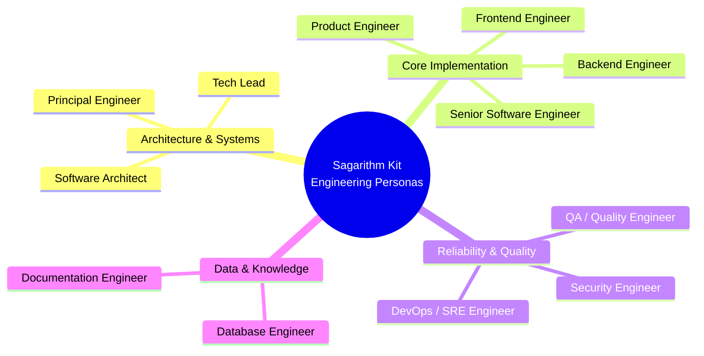
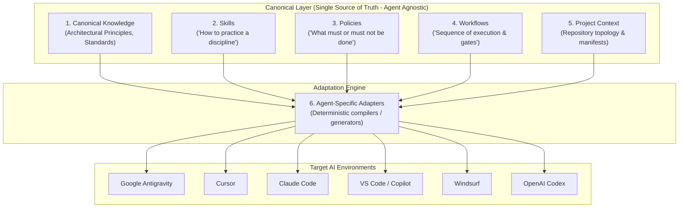

# Sagarithm Kit: Architectural Specification

## 1. System Vision & Product Thesis

**Sagarithm Kit** is a cross-agent software engineering framework for AI coding agents.

Its purpose is to provide AI coding agents with the structured engineering environment required to develop production-grade software according to disciplined, industry-standard engineering practices.

### 1.1 The Core Problem
AI coding agents commonly enter a repository with only a user prompt. Without embedded engineering discipline, agents suffer from recurring structural failure modes:
- Creating redundant abstractions, unnecessary folders, and duplicate utilities.
- Modifying critical code without inspecting existing architecture or dependencies.
- Confusing speculative code generation with actual verification.
- Introducing security vulnerabilities, unvetted dependencies, and architectural drift.

### 1.2 The Core Thesis
AI coding agents must not enter a codebase with only a prompt. They must enter with:
- **Project Context & Topology**
- **Engineering Principles & Coding Standards**
- **Specialized Engineering Skills**
- **Behavioral Policies & Boundaries**
- **Disciplined Workflows & Verification Gates**
- **Security & Quality Practices**

The conceptual engineering lifecycle is:
$$\text{Human} \longrightarrow \text{Sagarithm Kit} \longrightarrow \left[ \begin{matrix} \text{Context} \\ \text{Skills} \\ \text{Policies} \\ \text{Workflows} \end{matrix} \right] \longrightarrow \text{AI Agent} \longrightarrow \text{Implementation} \longrightarrow \text{Validation Gate} \longrightarrow \text{Production Software}$$

### 1.3 What Sagarithm Kit Is NOT
Sagarithm Kit is explicitly **NOT**:
- A starter template or boilerplate
- A generic prompt library
- A flat collection of `SKILL.md` files
- An `AGENTS.md` generator
- An AI IDE or editor replacement
- An application framework
- A code-snippet repository
- An Antigravity-specific or single-agent utility

Sagarithm Kit is an **engineering system** that maintains canonical engineering intelligence and projects it across multiple AI coding agents.

---

## 2. Development Environment vs. Target Platform

> **Google Antigravity is the development environment, NOT the target platform.**
> Sagarithm Kit must not become dependent on Antigravity-specific functionality, syntax, or runtime conventions.

Sagarithm Kit is designed as an agent-agnostic system. The initial ecosystem accounts for, at minimum:
- **Google Antigravity**
- **Cursor**
- **Claude Code**
- **VS Code / GitHub Copilot**
- **Windsurf**
- **OpenAI Codex**

Additional AI coding agents will be supported via adapters without altering canonical specifications.

---

## 3. Distributed Engineering Personas & Domains

Sagarithm Kit encodes the collective discipline and institutional knowledge normally distributed across experienced engineering specialists:

### 3.1 Engineering Domains
The system organizes specialized engineering knowledge across 11 core domains:
1. **Architecture**: System design, modularity, domain boundaries, separation of concerns, dependency graphs, ADRs, event-driven systems.
2. **Frontend**: Component architecture, state management, forms, accessibility, performance, design systems, frontend security.
3. **Backend**: API contracts, validation, error hierarchies, authentication/authorization, async queues, caching, observability.
4. **Database**: Schema normalization, indexing, migration strategies, transaction isolation, query tuning, data integrity.
5. **Testing**: Unit, integration, E2E, contract, property-based testing, mocking strategies, test isolation, coverage gates.
6. **Security**: Threat modeling, OWASP practices, input sanitization, secrets handling, dependency auditing, session integrity, rate limiting.
7. **DevOps / SRE**: CI/CD pipelines, containerization, deployment strategies, logging, metrics, tracing, health checks, rollback mechanisms.
8. **Quality Engineering**: Static analysis, type safety, linting, complexity budgets, maintainability metrics, quality gates.
9. **Documentation**: Architectural Decision Records (ADRs), API references, operational playbooks, developer guides, changelogs.
10. **Product Engineering**: Requirements breakdown, acceptance criteria, edge-case analysis, technical feasibility, Definition of Done.
11. **AI Engineering**: LLM application patterns, prompt architectures, structured outputs, tool-calling validation, evaluation suites, AI security.

---

## 4. Core Engineering Philosophy

Sagarithm Kit enforces 10 foundational principles across all interactions:

1. **Understand Before Modifying**: Inspect relevant existing code, architecture, dependencies, conventions, and constraints before significant modification.
2. **Inspect Before Creating**: Before creating a file, directory, abstraction, component, service, dependency, or configuration, inspect the existing repository.
3. **Reuse Before Duplicating**: Prefer extending or reusing existing functionality over inventing parallel implementations.
4. **Plan Before Significant Implementation**: Formulate a cohesive implementation plan before extensive code execution.
5. **Architecture Before Convenience**: Never sacrifice system architecture merely for short-term implementation convenience.
6. **Minimal Necessary Change**: Avoid unrelated modifications, style rewrites, or speculative refactoring.
7. **Validate Before Completion**: Code being written is not equivalent to code being verified.
8. **Never Claim Unverified Success**: Never claim tests, builds, deployments, or migrations succeeded without executing and inspecting verifiable evidence.
9. **Document Consequential Decisions**: Important architectural decisions and trade-offs must be recorded (e.g., via ADRs).
10. **Production Mindset**: Favor maintainability, reliability, security, testability, scalability, observability, accessibility, and operational correctness at all times.

---

## 5. The Six Decoupled Architectural Layers

Sagarithm Kit enforces strict separation between canonical specifications and target-agent implementations:

### Layer 1: Canonical Engineering Knowledge
- **Purpose**: Curated principles, architectural paradigms, design patterns, and engineering reasoning.
- **Form**: Neutral Markdown documents enriched with semantic YAML metadata.

### Layer 2: Skills
- **Purpose**: Answers *"How should an AI agent perform this engineering discipline correctly?"*
- **Form**: Composable, discoverable, versionable skill packages containing guidelines, references, code examples, and checklists.

### Layer 3: Policies
- **Purpose**: Answers *"What must or must not be done?"*
- **Form**: Non-negotiable behavioral boundaries and constraints categorized by severity (`error`, `warn`, `advisory`).

### Layer 4: Workflows
- **Purpose**: Answers *"What sequence should the agent follow to complete this type of task?"*
- **Form**: Phase-gated task lifecycles with prerequisites, execution steps, and mandatory verification gates.

### Layer 5: Project Context
- **Purpose**: Declarative workspace manifests (topology, dependencies, public interfaces, test harnesses) allowing agents to navigate existing code intelligently.

### Layer 6: Agent-Specific Adapters
- **Purpose**: One-way transformation pipeline that ingests Layers 1–5 and compiles native configuration files for target AI platforms.

---

## 6. Risk-Based Engineering & Verification Model

### 6.1 Risk Tiers
Sagarithm Kit categorizes changes into 4 risk tiers to calibrate the required validation rigor:

| Tier | Scope Examples | Validation Requirements |
| :--- | :--- | :--- |
| **Tier 1: Low** | Cosmetic tweaks, documentation, non-functional styling | Linting, syntax check, local visual review |
| **Tier 2: Medium** | Isolated component additions, internal utilities, localized logic | Unit tests, static analysis, type checking |
| **Tier 3: High** | Database migrations, authentication, external API contracts, new dependencies | Unit + Integration tests, security scan, schema validation |
| **Tier 4: Critical** | Financial flows, secrets, cryptographic logic, destructive migrations, infra | Full test suite, regression verification, manual human sign-off |

### 6.2 Verification Taxonomy
Sagarithm Kit strictly prohibits **Assumed Success**. All work tracks through explicit verification states:
- **Implemented** $\neq$ **Tested** $\neq$ **Verified**.

---

## 7. Phased Implementation Roadmap

Development of Sagarithm Kit proceeds across 10 disciplined phases:

- **Phase 0 — Foundation**: Repository inspection, canonical taxonomy, meta-specification, architecture, and governance standards. *(Current Phase)*
- **Phase 1 — Engineering Constitution**: Encoding core engineering, architectural, coding, security, and testing principles.
- **Phase 2 — Core Skills**: Prototyping and validating the initial skill specification across Architecture, Coding Standards, Testing, Security, and Documentation.
- **Phase 3 — Policies**: Implementing invariant policies (file creation, directory creation, dependency limits, change containment).
- **Phase 4 — Workflows**: Formalizing task lifecycles (Feature, Bug Fix, Refactor, Release).
- **Phase 5 — Agent Adapters**: Developing native compilers for Antigravity, Cursor, Claude Code, Copilot, Windsurf, and Codex.
- **Phase 6 — CLI**: Building the `sagarithm` CLI (`init`, `sync`, `doctor`, `audit`, `verify`).
- **Phase 7 — Project Intelligence**: Repository graph analysis, topology indexing, and context extraction.
- **Phase 8 — Validation & Audit Engine**: Automated engineering health checks and policy audit runners.
- **Phase 9 — Registry & Ecosystem**: Community skill ecosystem, versioning, organization presets, and enterprise governance.
