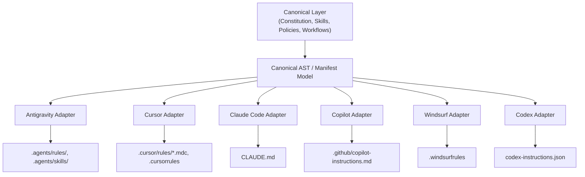

# Agent Adapters

> **Deterministic Compilation Pipeline from Canonical Engineering Specifications to Native Agent Runtimes**

An **Adapter** is a one-way transformation engine that reads Sagarithm Kit's canonical specifications (Constitution, Skills, Policies, Workflows, Project Context) and compiles them into the native, proprietary configuration formats expected by specific AI coding environments.

---

## 1. The Core Adapter Principles

1. **One-Way Compilation**: Canonical specifications are the single source of truth. Adapters compile downstream. Changes are never authored directly in generated adapter files.
2. **Deterministic & Idempotent**: Compiling a canonical version against an adapter template must produce byte-for-byte identical output on every run.
3. **No Upstream Pollution**: Target platform quirks (e.g. Cursor's glob syntax, Claude Code's bash execution format) belong strictly inside that agent's adapter templates, never leaking into `constitution/`, `skills/`, `policies/`, or `workflows/`.
4. **Non-Destructive Reconciliation**: Adapters must emit markers (e.g. `<!-- SAGARITHM:START -->` ... `<!-- SAGARITHM:END -->`) when injecting into shared configuration files to preserve human customizations.

---

## 2. Target Platform Ecosystem Matrix

| Target Platform | Native Rules Target | Native Skills Target | Context & Tooling Mechanism |
| :--- | :--- | :--- | :--- |
| **[Google Antigravity](antigravity/README.md)** | `.agents/rules/*.md`, `GEMINI.md` | `.agents/skills/<skill>/SKILL.md` | Workspace context injections, Antigravity tools |
| **[Cursor](cursor/README.md)** | `.cursor/rules/*.mdc`, `.cursorrules` | MCP tools, custom terminal commands | `.cursorrules`, Cursor system indexing |
| **[Claude Code](claude-code/README.md)** | `CLAUDE.md` guidelines | Slash commands, bash execution | `CLAUDE.md`, `.claude/` project config |
| **[VS Code / GitHub Copilot](copilot/README.md)** | `.github/copilot-instructions.md` | VS Code tasks, Copilot extensions / MCP | Prompt files (`.prompts/*.prompt.md`) |
| **[Windsurf](windsurf/README.md)** | `.windsurfrules` | Cascade flows, shell commands | `.windsurfrules`, Cascade workflows |
| **[OpenAI Codex](codex/README.md)** | System instructions | Tool calling / OpenAPI JSON schemas | Assistant prompt definitions |

---

## 3. Compilation Lifecycle

