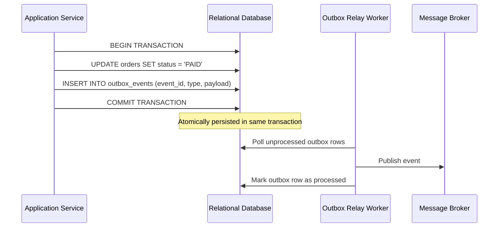

# Reference: Domain Boundaries & Event-Driven Decoupling

## 1. Strategic Domain-Driven Design (DDD)

### Bounded Contexts
- Every domain model must operate within a clearly demarcated **Bounded Context**.
- A concept named `User` in an **Identity Context** (credentials, email verification, MFA) has different invariants and lifecycle rules than a `Customer` in a **Billing Context** (payment methods, invoice address) or an `Author` in a **Content Context**.
- **Rule**: Never create a unified "omnibus" entity that spans multiple bounded contexts. Keep models distinct and map between contexts at boundary ports.

### Aggregate Roots & Transaction Boundaries
- An **Aggregate Root** is the sole gateway to an entity cluster.
- Outside modules cannot directly mutate child entities within an aggregate; all operations must flow through methods on the root entity.
- **Transaction Rule**: A single database transaction should strictly mutate only **one** aggregate root. Cross-aggregate coordination must occur asynchronously via domain events to prevent long database lock times and distributed deadlocks.

---

## 2. The Transactional Outbox Pattern

When a business operation modifies database state and must publish an event or message to a broker (e.g. Kafka, RabbitMQ, SQS), writing to the database and publishing to the message broker in two separate network calls leads to data inconsistency:

```text
Database Commit succeeds  ──▶  Network drops before Event Publish  ──▶  Message Lost!
```

### The Outbox Solution


---

## 3. Anti-Corruption Layer (ACL)

When consuming external, legacy, or third-party APIs:
1. **Never** allow external third-party data shapes to propagate throughout your internal application domain.
2. Build an **Anti-Corruption Layer (ACL)**:
   - **Translator / Mapper**: Maps external payloads into native domain value objects.
   - **Adapter**: Implements an internal port interface and wraps the external client.
   - **Isolator**: Ensures changes to vendor schemas break only the ACL translator, leaving internal business logic completely untouched.
