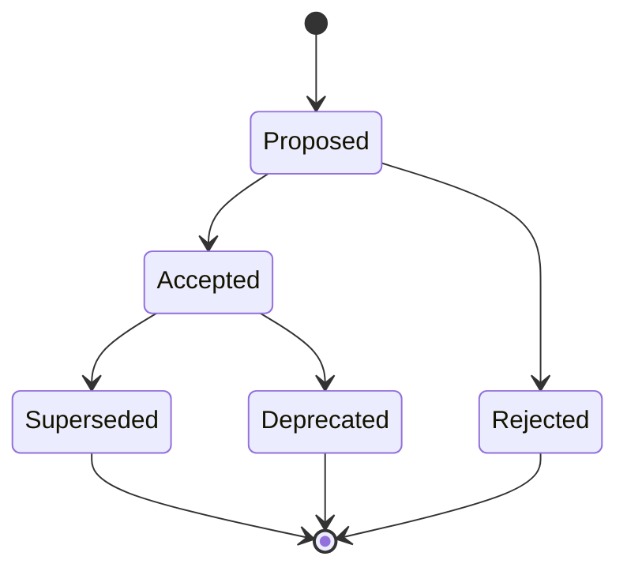

# Reference: ADR Lifecycle & Structure

## 1. ADR Lifecycle States

- **Proposed**: Under review and RFC discussion.
- **Accepted**: Approved by engineering team / leads and actively governing the codebase.
- **Rejected**: Evaluated but declined; preserved for historical reference to prevent re-debating.
- **Deprecated**: No longer recommended, but still present in legacy portions of the system.
- **Superseded**: Formally replaced by a newer ADR (e.g. `Superseded by ADR-014`).

---

## 2. Key Sections of an ADR

1. **Title**: Sequenced index and short title (e.g. `ADR-003: Use Zod for Boundary Schema Validation`).
2. **Status**: Current lifecycle state and date.
3. **Context**: What technical or business conditions force this decision? What constraints apply?
4. **Decision**: What specific approach or technology is chosen?
5. **Consequences**:
   - **Positive**: What benefits and simplifications are achieved?
   - **Negative**: What operational friction, performance costs, or technical debt is accepted?
