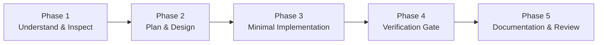

# Canonical Workflows

> **Structured Execution Lifecycles and Verification Gates for AI Coding Agents**

A **Workflow** defines the temporal sequence and quality gates an agent must follow to safely complete a specific class of engineering tasks.

While a **Skill** answers *"How should this engineering discipline be practiced?"* and a **Policy** answers *"What must or must not be done?"*, a **Workflow** answers:
> *"In what exact sequence should an agent proceed, and what verification gates must be cleared before moving to the next stage?"*

---

## The Universal Five-Phase Engineering Lifecycle

Every workflow in Sagarithm Kit is structured around five disciplined phases:

1. **Understand & Inspect**: Baseline code analysis, dependency inspection, and requirement clarification.
2. **Plan & Design**: Blast radius calculation, risk tier categorization, and test strategy formulation.
3. **Minimal Implementation**: Isolated, cohesive code modifications strictly respecting project policies.
4. **Verification Gate**: Concrete execution and terminal inspection of test suites, type checking, and linters (**Zero Assumed Success**).
5. **Documentation & Review**: Synchronizing ADRs, updating changelogs, and summarizing verifiable evidence.

---

## Workflow Catalog

| Workflow | Identifier | Primary Purpose | Required Verification Gate |
| :--- | :--- | :--- | :--- |
| [Feature Development](feature-development-workflow.md) | `workflow.feature-development` | End-to-end implementation of new capabilities | Unit + Integration tests, boundary validation, schema checks |
| [Bug Fix](bug-fix-workflow.md) | `workflow.bug-fix` | Safe defect resolution with zero regressions | Reproducing test (Red) $\rightarrow$ Fix (Green) $\rightarrow$ Regression suite |
| [Refactoring](refactoring-workflow.md) | `workflow.refactoring` | Structural improvements without behavioral drift | Baseline green tests $\rightarrow$ Transformation $\rightarrow$ Clean parity verification |
| [Release](release-workflow.md) | `workflow.release` | Version tagging, migration safety, rollbacks | Full sanity suite, SemVer validation, rollback plan |
